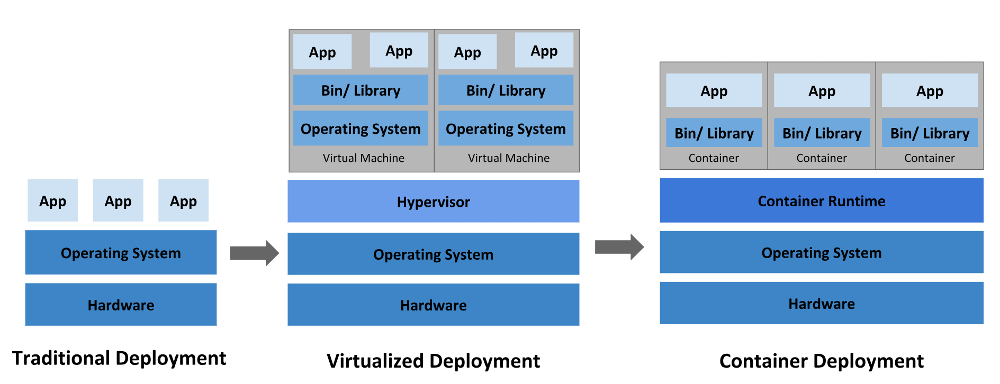

# Historical context for Kubernetes
Let's take a look at why Kubernetes is so useful by going back in time.

## 🕰️ **Historical Context of Kubernetes**

### ⚙️ 1. **Traditional Deployment Era (Physical Servers)**

* Apps ran directly on **physical servers**.
* No way to isolate or control **resource usage** between apps.
* One app could hog resources, causing others to underperform.
* Solution: run each app on a separate server — **expensive** and **inefficient** (low resource utilization).

---

### 🖥️ 2. **Virtualized Deployment Era (VMs)**

* **Virtual Machines (VMs)** allowed multiple OS instances on one physical server.
* Apps became **isolated**, more **secure**, and **easier to scale**.
* Better **resource utilization** and **reduced hardware costs**.
* But VMs are **heavyweight**, each with its own OS and longer startup times.

---

### 📦 3. **Container Deployment Era**

* **Containers** offer lightweight alternatives to VMs.
* Share the **host OS**, making them faster and more efficient.
* Still provide **isolation** (filesystem, CPU, memory, etc.)
* Ideal for **cloud-native** and **microservices** architectures.

#### 🚀 Containers Offer:

* Faster, agile development and deployment.
* Consistency across dev, test, and production environments.
* Easy portability across OS and cloud platforms.
* Efficient resource usage and performance.
* Strong support for **CI/CD**, **observability**, and **scaling**.

---

### 🧠 Why Kubernetes?

As containers gained popularity, managing them at scale became complex. Kubernetes was created to **automate** container deployment, scaling, and management — solving the very challenges containers introduced at scale.

---