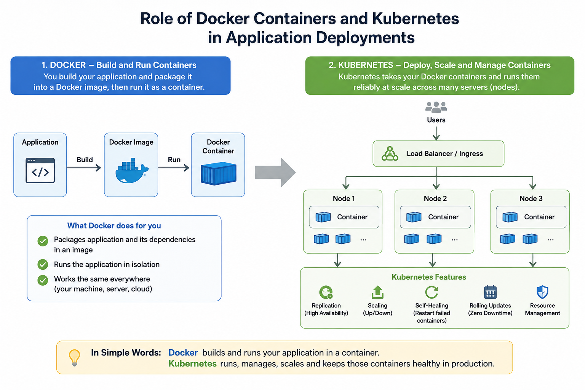
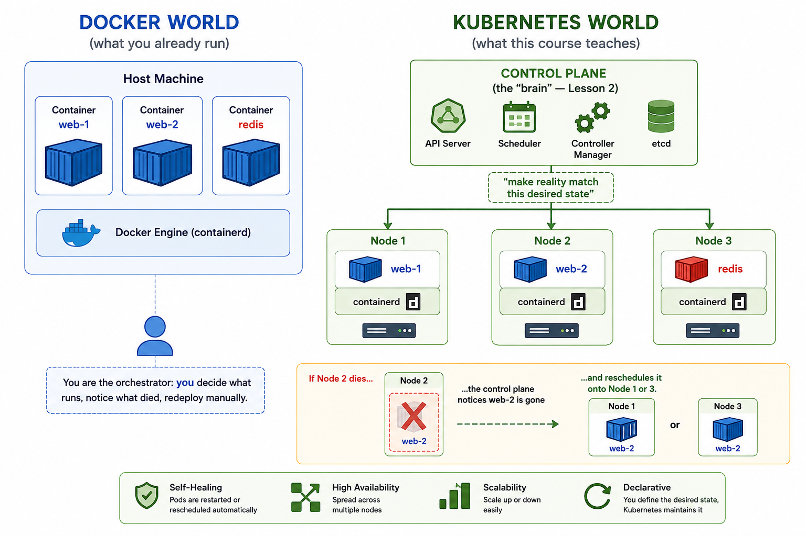

# Lesson 1 — Why Kubernetes?

## Lesson Objectives

By the end of this lesson you will be able to:

- Articulate, from first-hand experience (not just theory), the exact
  operational problems that appear the moment you run Docker containers
  across *more than one machine*, or need them to survive failure
  unattended.
- Explain precisely what Kubernetes is (and is not) — including the
  Docker/dockershim/containerd relationship, which trips up almost every
  Docker engineer moving to K8s.
- Distinguish "orchestration" from "containerization" as separate concerns.
- Know why Kubernetes' *declarative, reconciliation-loop* model is
  fundamentally different from how you drive Docker today.

---

## Theory

You already know how to solve "run this container reliably" on **one
machine**: `docker run --restart=always`, maybe `docker compose up -d` with
a `deploy.replicas` block, maybe a systemd unit wrapping `docker run`. That
covers a huge fraction of side-project and small-app deployments. 



Kubernetes exists because production systems eventually violate the
assumptions that make the Docker model work:

1. **One machine is not enough.** Once your workload needs more CPU/RAM
   than a single host has, or you need to survive a host dying, you have a
   *fleet* of machines. Docker has no native concept of "a fleet" — Docker
   Engine manages containers on the box it's running on, full stop. (Docker
   Swarm attempted to solve this — more on that below.)
2. **Failure is not an edge case, it's Tuesday.** At small scale, a
   container crashing is a page-worthy incident. At the scale Kubernetes
   targets (hundreds/thousands of containers across dozens/hundreds of
   nodes), *something* is always failing — a disk fills up, a node's kernel
   panics, a pod OOMs. You cannot have a human (or even a `--restart=always`
   flag scoped to one host) be the failure-recovery mechanism. You need a
   system that continuously watches "what should be running" versus "what
   is actually running" and closes the gap, automatically, forever.
3. **Traffic needs to find healthy containers, across hosts, as they move.**
   With Docker Compose on one host you can point nginx at
   `container_name:port` because Compose's embedded DNS resolves it. The
   moment containers are scheduled across *many* hosts, and can be
   killed/rescheduled onto a *different* host at any time, "which IP do I
   send traffic to" becomes a genuinely hard, continuously-changing
   problem.
4. **Rolling out a new version without downtime is a distributed systems
   problem.** You know `docker stop old && docker run new` causes a gap.
   Doing this safely — bring up new version, wait until it's actually
   healthy (not just started), shift traffic, drain and remove the old
   version, and be able to abort/rollback mid-flight if the new version is
   bad — requires *coordination logic*, not just container commands.

None of these four problems are about **how to package or run a single
container** — you've already solved that with Docker. They are all about
**coordinating many containers, across many machines, over time, in the
face of constant partial failure.** That coordination problem is called
**container orchestration**, and Kubernetes is the dominant system for
solving it.

### The declarative shift (the single most important mental model change)

This is the crux of "thinking in Kubernetes" versus "thinking in Docker,"
and it's worth sitting with before we touch any commands.

- **Docker CLI is imperative.** Every command is an instruction: "run this
  container now." `docker run`, `docker stop`, `docker rm` — you are
  telling Docker *what action to take*, once, right now. If the container
  dies later, Docker does nothing unless you set a restart policy (and even
  that is a narrow, local rule: "restart on this host if it exits").

- **Kubernetes is declarative and self-correcting.** You don't tell
  Kubernetes "start 3 containers." You tell it "I want 3 healthy replicas
  of this container to exist, permanently, as a fact about the world" — and
  then Kubernetes runs a **control loop**, forever, comparing that desired
  state against the observed actual state, and taking whatever actions are
  needed to close the gap. If a node dies and takes 2 of your 3 replicas
  with it, nothing "fires an alert that triggers a restart script" — the
  control loop simply notices "desired = 3, actual = 1" on its next tick
  (sub-second) and schedules 2 new replicas onto healthy nodes. This
  pattern — **desired state, observed state, reconciliation loop** — is
  called a **controller**, and it is the architectural idea that
  *everything* in Kubernetes is built from. We will see it again in nearly
  every lesson (ReplicaSets, Deployments, Jobs, HPA — all controllers
  running the same loop shape).

You'll write this desired state as YAML and hand it to the cluster (Lesson
6 covers the YAML itself in depth). For now, internalize the shape: **you
declare an end state; Kubernetes' job is to make reality match it,
continuously, without you in the loop.**

### "Doesn't Docker Swarm already do this?"

Yes — Swarm is Docker's own answer to orchestration (multi-host scheduling,
service discovery, rolling updates, `docker service` as a declarative-ish
primitive). It's simpler than Kubernetes and, for small clusters, honestly
pleasant. It lost the industry-standard position for a few concrete
reasons: a smaller/slower ecosystem (fewer cloud-managed offerings, fewer
third-party integrations), a much thinner extensibility model (Kubernetes'
API is designed to be extended with Custom Resource Definitions — this is
how Helm, Prometheus Operator, cert-manager, Istio etc. all plug in), and
network effects — once AWS/GCP/Azure all standardized on offering *managed
Kubernetes* (EKS/GKE/AKS), Swarm's adoption curve flattened. You should
know Swarm exists and roughly what it offers (it'll come up in interviews),
but production hiring in 2026 overwhelmingly means Kubernetes.

### "Is Kubernetes replacing Docker, then?"

Partially, and precisely — this is worth getting exactly right because it's
a very common source of confusion for people with your background.

- **Docker Desktop / Docker CLI / `docker build`**: still exactly what you
  use to build images. Kubernetes does not build images. Nothing changes
  in your Dockerfile workflow.
- **Docker Engine as the thing that *runs* containers on a Kubernetes
  node**: this part *has* changed, and it's a good interview-grade fact to
  know. Early Kubernetes used Docker Engine on every node via a shim called
  **dockershim**, translating Kubernetes' generic **CRI (Container Runtime
  Interface)** calls into Docker Engine API calls. As of **Kubernetes
  1.24 (2022)**, dockershim was removed from Kubernetes core. Nodes now
  run a **CRI-native runtime directly** — almost always **containerd**
  (which, notably, Docker Engine itself has always used *under the hood* —
  Docker Engine is a friendly daemon/CLI layered on top of containerd) or
  **CRI-O**. So: the *images* you build with `docker build` are unaffected
  (they're standard **OCI images**, a spec Docker helped create, and every
  CRI runtime consumes them fine) — but the daemon *scheduling and running*
  those containers on a K8s node is containerd, not Docker Engine.

So: you keep using Docker locally to build and test images exactly as
today. What changes is everything about *running those images reliably,
at scale, across machines* — and that's the entire subject of this course.

---

## Architecture Diagram

Single-host Docker vs. what Kubernetes coordinates. We'll go one level
deeper into the control plane's internals in Lesson 2 — this is the
30,000-foot picture, just to place the pieces.



---

## Docker Comparison

| Concern | Docker (alone) | Kubernetes |
|---|---|---|
| Scope | One host | A cluster of many hosts |
| Interaction model | Imperative (`docker run`, `docker stop`) | Declarative (submit desired state, controller reconciles) |
| Self-healing | Only `--restart` policy, same host only | Continuous reconciliation loop, reschedules onto *any* healthy node |
| Service discovery | Compose's embedded DNS (single host) | Cluster-wide DNS + stable virtual IPs that survive pod rescheduling (Service objects — Lesson 9) |
| Scaling | `docker compose up --scale`, still one host's capacity | Schedules replicas across the whole cluster's capacity; can autoscale on metrics (Lesson 23) |
| Rolling updates | Manual stop/start choreography | Built-in, health-gated, automatically abortable (Lesson 8) |
| Config/secrets | `.env` files, Compose `environment:` | First-class objects (ConfigMap/Secret) mounted or injected, updatable independent of images (Lessons 12–13) |
| What builds images | `docker build` | Nothing — unchanged, still your job with Docker |
| What runs images | Docker Engine (containerd underneath) | containerd/CRI-O directly, no Docker Engine involved since K8s 1.24 |

The important reframe: **Docker Compose and Kubernetes are not
competitors at the same layer.** Compose is a *convenience layer for
running a fixed set of containers on one machine*, mainly for local dev.
Kubernetes is a *distributed operating system for a fleet of machines*.
You'll actually keep using Compose for local dev in many real teams —
Kubernetes (via Kind) is what we're setting up in Lesson 3 to mirror
production.

---

## Internal Working

Nothing to run yet — this section previews *why* the architecture is
shaped the way it is, mechanically, so Lesson 2 isn't your first exposure
to these ideas:

- Every object you'll ever create in Kubernetes (Pod, Deployment, Service,
  ConfigMap, everything) is stored as a record in **etcd**, a distributed
  key-value store — think of it as the cluster's single source of truth
  database.
- The **API Server** is the only thing that talks to etcd directly. Every
  tool you use (`kubectl`, dashboards, CI/CD pipelines) talks to the API
  Server over HTTPS with a REST-ish API — never to etcd directly.
- A collection of **controllers** (separate control loops, one concern
  each) watch the API Server for objects they care about and continuously
  reconcile: "does reality match what's declared?" This is why creating a
  Deployment doesn't *directly* create Pods — the Deployment controller
  notices a new Deployment object, creates a ReplicaSet object for it, and
  the ReplicaSet controller notices *that* and creates Pod objects. Layers
  of small, single-purpose reconciliation loops, not one monolith. You'll
  feel this directly in Lesson 7–8.
- The **Scheduler** is one specific controller: it watches for Pods that
  exist but haven't been assigned to a node yet, and picks a node for them
  based on resource availability and constraints.

Full deep-dive with diagrams of each of these pieces is Lesson 2 — I'm
naming them now so the vocabulary isn't new when we get there.

---

## Hands-on Lab

You won't touch Kubernetes yet — that's Lesson 3 onward. Instead, this lab
puts you through the *exact pain* Kubernetes exists to remove, using only
Docker, which you already know cold. The goal is to make Lesson 1's theory
visceral rather than abstract. Do this for real; don't just read it.

We'll use `traefik/whoami` — a tiny HTTP server whose only job is to
respond with its own container hostname. That makes it trivial to see,
just by curling, *which specific container* answered your request — perfect
for exposing load-balancing and failover problems.

**Step 1 — Run three "replicas" by hand.**

```bash
docker run -d --name web1 -p 8081:80 traefik/whoami
docker run -d --name web2 -p 8082:80 traefik/whoami
docker run -d --name web3 -p 8083:80 traefik/whoami
```

What this does: `-d` runs each container detached (in the background).
`--name` gives it a fixed name so we can refer to it later. `-p 8081:80`
publishes container port 80 to host port 8081 (and 8082/8083 for the
other two) — three separate ports because Docker can't have three
containers bound to the same host port.

Confirm all three are up and, critically, notice you already had to
hand-manage port numbers yourself — nothing assigned them for you:

```bash
docker ps --filter "name=web"
```

**Step 2 — Feel the "which one answered?" problem.**

```bash
curl -s localhost:8081 | grep Hostname
curl -s localhost:8082 | grep Hostname
curl -s localhost:8083 | grep Hostname
```

Three different hostnames come back. Now ask yourself: *if you were a
client of this app, how would you know which port to call?* In real life
your client just wants "the app" — it shouldn't need to know there are 3
replicas, on 3 specific ports, on this specific host. Right now, **you**
are the load balancer, manually, in your head.

**Step 3 — Kill one and watch nothing heal.**

```bash
docker kill web2
docker ps --filter "name=web"
```

`web2` is gone. No new container appeared to replace it. If a client had
been sending a third of its traffic to port 8082, that third is now just
broken until a human notices and runs `docker run` again. This is the
"self-healing" gap.

Try adding `--restart=always` and repeat the kill:

```bash
docker rm -f web2
docker run -d --name web2 --restart=always -p 8082:80 traefik/whoami
docker kill web2
sleep 2
docker ps --filter "name=web2"
```

`web2` comes back — Docker's restart policy *does* handle "process died,
relaunch it, on this host." Good, but notice the ceiling: this only works
because `web2` is still assigned to *this* machine. If this whole host
had crashed instead of just the container, `--restart=always` does
nothing — there's no other host for it to fail over to, because Docker
Engine has no concept of "other hosts."

**Step 4 — Try to simulate a zero-downtime rollout by hand.**

Pretend `traefik/whoami` just shipped a v2 and you need to replace all
three running containers without ever having zero healthy backends. Do it:

```bash
docker run -d --name web1-new -p 8091:80 traefik/whoami   # bring up replacement first
curl -s localhost:8091 | grep Hostname                     # manually verify it's healthy
docker rm -f web1                                           # only now remove the old one
```

That's one container, and it already required you to: pick a temporary
new port, remember to verify health *yourself* before cutting over, and
remember to clean up the old container and reclaim the port. Now imagine
doing that correctly, in the right order, for 50 replicas across 10 hosts,
without a human watching — and being able to automatically *abort* halfway
through if the new version turns out to be broken. That coordination
logic is exactly what a Kubernetes **Deployment**'s rolling update
strategy gives you for free (Lesson 8) — you'll redo this exact scenario
there and compare the experience directly.

**Cleanup:**

```bash
docker rm -f web1 web1-new web2 web3
```

---

## YAML Walkthrough

Not applicable to this lesson — we haven't created a Kubernetes object
yet, so there's no manifest to walk through. Lesson 6 is dedicated
entirely to how Kubernetes YAML is structured (`apiVersion`, `kind`,
`metadata`, `spec`, `status`) before we lean on it in every lesson after.

---

## Troubleshooting

Common misconceptions at this stage — better to correct them now than
mid-lab later:

- **"Kubernetes replaces Docker."** Wrong framing — see the Theory
  section above. You still build images with `docker build`; Kubernetes
  takes over *running and coordinating* those images at fleet scale.
- **"I need Docker Engine installed on every Kubernetes node."** No —
  since Kubernetes 1.24, nodes run containerd (or CRI-O) directly. If you
  see `docker ps` show nothing on a K8s node but pods are clearly running,
  that's expected: check with `crictl ps` instead, or (as you'll do from
  Lesson 4 onward) just use `kubectl`, which never cares about the
  underlying runtime.
- **"Kubernetes will make my single-container hobby app better."** Often
  not true below a certain scale — Kubernetes adds real operational
  complexity (a control plane to run, YAML to maintain, new failure modes
  of its own). It earns its cost once you have multiple services, need
  multi-host resilience, or need standardized deployment across a team.
  Good instinct to build now: always ask "am I solving problem 1-4 from
  the Theory section, or cargo-culting infrastructure?"
- **`docker: command not found` inside a Kubernetes node/pod** — expected
  and correct per the containerd point above; this is not a broken
  install.

---

## Best Practices

- Don't reach for Kubernetes because it's the industry-standard buzzword —
  reach for it when you can name which of the four coordination problems
  (multi-host scale, unattended self-healing, dynamic service discovery,
  safe rollouts) you actually have. Plenty of production systems correctly
  run on a single well-monitored host with `--restart=always` and a good
  on-call process.
- When you do adopt it, budget real time for the control plane itself as
  infrastructure you operate (or, in production, almost always *pay a
  cloud provider to operate for you* — this is exactly what Lesson 31,
  Managed Kubernetes, is about).
- Keep your mental model of "Docker builds, Kubernetes runs" clean — it
  will save you from a lot of confused debugging later when, e.g., an
  image builds and runs fine locally with `docker run` but the pod fails
  the moment you deploy it to a cluster (usually not a Docker problem — a
  cluster-config problem, which is most of Lessons 4 onward).

---

## Interview Questions

1. **"What problem does Kubernetes solve that Docker alone doesn't?"**
   Docker manages containers on a single host, imperatively. Kubernetes
   orchestrates containers across a *fleet* of hosts, *declaratively*: it
   continuously reconciles actual state against desired state, so
   self-healing, scheduling, service discovery, and rollouts happen
   without manual intervention — none of which Docker Engine does on its
   own.

2. **"Is Kubernetes a replacement for Docker?"**
   No — it replaces the *orchestration* layer. Docker (or any OCI-compliant
   build tool) still builds your images. What changed is that Kubernetes
   nodes run containers via containerd/CRI-O directly rather than via
   Docker Engine (dockershim was removed in K8s 1.24) — but that's an
   implementation detail of the node, invisible to how you build or use
   images.

3. **"What is a reconciliation loop / controller pattern, and why does
   Kubernetes use it everywhere instead of one-shot imperative commands?"**
   A controller continuously compares desired state (what you declared)
   against observed state (what's actually running) and takes corrective
   action to close any gap — forever, without a human triggering each
   correction. It's used pervasively because at fleet scale, failure is
   constant and a human-in-the-loop or single imperative command can't
   keep up; a self-correcting system can.

4. **"Why did Kubernetes drop Docker Engine as a supported runtime?"**
   Kubernetes standardized on CRI (Container Runtime Interface) so any
   compliant runtime can be swapped in. Docker Engine predates CRI and
   needed a translation shim (dockershim) to work with it, which was extra
   maintenance burden for a wrapper around containerd — a runtime
   Kubernetes could already talk to natively. Removing dockershim (v1.24)
   simplified the stack; OCI images built by `docker build` are unaffected
   because they conform to the same open image spec every CRI runtime
   consumes.

5. **"When would you *not* use Kubernetes?"**
   Single-host apps without multi-host scale or self-healing requirements;
   small teams without the operational bandwidth to run/learn a cluster
   (mitigated by managed offerings, Lesson 31, but there's still cognitive
   overhead); latency-sensitive edge cases where the abstraction itself
   adds unacceptable overhead. Good candidates instead: `docker
   compose` on a well-monitored host, or a PaaS (e.g., managed container
   services) that hides orchestration entirely.

---

## Mini Assignment

Re-run the Hands-on Lab, but this time script the *entire* rolling-update
scenario from Step 4 for **all three** `web1/web2/web3` containers — bring
up three replacements, health-check each one before cutting over, and tear
down the three originals — using nothing but a bash script wrapping
`docker` commands. No solution is provided here on purpose.

While you do it, keep a running list (just a text note, doesn't need to be
formal) of every manual decision your script had to make that felt like it
*shouldn't* be your problem — port allocation, health-check timing,
ordering, rollback-on-failure logic, etc. Bring that list to our next
session's discussion; we'll map each item directly onto the Kubernetes
feature that eliminates it as we go through the course.

---

## Lesson Summary

- Docker solves packaging and running **one container on one host**;
  Kubernetes solves **coordinating many containers across many hosts**,
  a distinct problem called container orchestration.
- The core mental shift is **imperative → declarative**: instead of issuing
  commands, you declare desired state and a **controller** continuously
  reconciles reality to match it — self-healing, scaling, and rollouts all
  fall out of this one pattern.
- Kubernetes doesn't replace Docker's build step — `docker build` is
  unchanged. It replaces Docker Engine as the thing that *runs* containers
  on each node (via containerd/CRI-O directly, since dockershim's removal
  in v1.24), and layers a whole control plane on top for scheduling,
  discovery, and healing across the cluster.
- Docker Swarm was Docker's own attempt at this; Kubernetes won the
  ecosystem largely on extensibility and cloud-provider adoption.
- You felt the actual gaps first-hand: no cross-host self-healing, manual
  load balancing across ports, and hand-choreographed "rolling updates" —
  these four pain points *are* the syllabus for the rest of this course.

---

### ✅ Before we move to Lesson 2 (Kubernetes Architecture)

Answer these for yourself (out loud or in writing) — tell me your answers
and any part that felt shaky, and we'll clear it up before continuing:

1. In your own words, what's the difference between "orchestration" and
   "containerization"?
2. Why doesn't `docker run --restart=always` fully solve the self-healing
   problem at fleet scale?
3. What specifically changed about Docker's role in Kubernetes after
   dockershim was removed — and what *didn't* change?
4. From the Mini Assignment: what's on your list of things that "felt like
   they shouldn't be your problem"?
